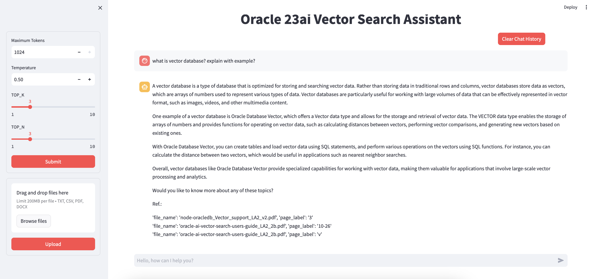

# Integrate Oracle 23ai Vector DB with OCI GenAI using Llama-index

[](https://www.python.org/downloads/release/python-3110/)

## Introduction

Accessing the right answers from vast data repositories is a challenge many organizations face. A **Retrieval-Augmented Generation (RAG)** based system can revolutionize how users interact with their data by making information easily accessible and up-to-date. In this workshop, we’ll build a RAG-based chatbot using **Oracle Database 23ai** and **OCI Generative AI** services, allowing users to chat with their unstructured data like PDF, CSV, and TXT files. This approach combines advanced retrieval techniques with generative AI, creating a powerful solution for intelligent and dynamic data interaction.


## What is RAG?

**Retrieval-Augmented Generation (RAG)** combines retrieval-based methods with generative AI to provide more accurate and contextually relevant responses by accessing and utilizing large datasets dynamically. [Learn more about RAG](https://www.oracle.com/artificial-intelligence/generative-ai/retrieval-augmented-generation-rag/).

## Prerequisites and Setup

Before you begin, ensure you have the following:

- **Oracle Cloud Account**  
  [Sign up here](https://www.oracle.com/cloud/free/)
  
- **Oracle Database 23AI**  
  [Learn more](https://www.oracle.com/database/23ai/)
  
- **Compute VM**  
  This will serve as your web app. Ensure the Compute VM can communicate with the Oracle Database by setting up the appropriate network configurations.
  
- **OCI Generative AI Services**  
  [Documentation](https://docs.oracle.com/en-us/iaas/Content/GenerativeAI/home.htm)
  
- **LlamaIndex**  
  [Documentation](https://pypi.org/project/llama-index/)
  
- **Python Dependencies**  
  Listed in the `requirements.txt` file in the repository.

## Setup

### 1. Clone the Repository in your web server (Compute VM)

```bash
git clone https://github.com/SaurabhSalunkhe/Oracle-23ai-RAG-Chatbot.git
```

### 2. Update and Install Dependencies (Oracle Linux)
```
sudo yum update -y && sudo yum install -y git python3 && sudo yum groupinstall -y "Development Tools" && sudo yum install -y bzip2-devel openssl-devel libffi-devel zlib-devel wget libffi-devel openssl openssl-devel tk-devel xz-devel zlib-devel bzip2-devel readline-devel libuuid-devel ncurses-devel libaio

```

### 3. Install Python 3.11.x
Ensure Python version 3.11.x is installed.

```
mkdir -p $HOME/python
wget https://www.python.org/ftp/python/3.11.0/Python-3.11.0.tgz
tar -xvzf Python-3.11.0.tgz --strip-components=1 -C /home/$USER/python
cd $HOME/python
./configure --prefix=$HOME/python
make clean; make
make altinstall

export PYTHONHOME=$HOME/python
export PATH=$PYTHONHOME/bin:$PATH
export LD_LIBRARY_PATH=$PYTHONHOME/lib:$LD_LIBRARY_PATH

cd $HOME/python/bin
ln -s python3.11 python3
ln -s pip3.11 pip3

```

### 4. Create and Activate Virtual Environment
```
cd Oracle-23ai-RAG-Chatbot
python3.11 -m venv venv
source venv/bin/activate
```

### 5. Install Python Dependencies

```
pip install -r requirements.txt
```

### 6. Configure OCI Authentication
a. Create the .oci Directory

```
mkdir -p /home/opc/.oci
```

b. Generate OCI API Keys
Follow the OCI SDK Configuration Guide to generate your API keys.
https://docs.oracle.com/en-us/iaas/Content/API/Concepts/sdkconfig.htm 

https://docs.oracle.com/en-us/iaas/Content/API/Concepts/apisigningkey.htm#apisigningkey_topic_How_to_Generate_an_API_Signing_Key_Console 

### 7. Set Up Oracle Database 23ai
a. Run SQL Commands from create_tables.sql
Create the User and Grant Privileges

```
-- Create the user with a specified password
CREATE USER ai_user IDENTIFIED BY "EXamplepassword#_123";

-- Grant DBA privileges for full administrative access
GRANT DBA TO ai_user;

-- Grant specific roles and privileges needed for Oracle AI Vector Search
GRANT DB_DEVELOPER_ROLE TO ai_user;
GRANT CREATE MINING MODEL TO ai_user;
```

As ai_user, Create Tables with Vector Data Types


```
CREATE TABLE BOOKS (
    ID NUMBER NOT NULL,
    NAME VARCHAR2(100) NOT NULL,
    PRIMARY KEY (ID)
);

CREATE TABLE CHUNKS (
    ID VARCHAR2(64) NOT NULL,
    CHUNK CLOB,
    VEC VECTOR(1024, FLOAT64),
    PAGE_NUM VARCHAR2(10),
    BOOK_ID NUMBER,
    PRIMARY KEY (ID),
    CONSTRAINT fk_book
        FOREIGN KEY (BOOK_ID)
        REFERENCES BOOKS (ID)
);
```

8. Configure the Application
a. Edit config.py
Update the following parameters with your details:

```
# DB connections (Below are example credentials. Substitute with your credentials)
DB_USER = "ai_user"
DB_PWD = "EXamplepassword#_123"
DB_HOST_IP = "ip:1521"
DB_SERVICE = "example_PDB1.sub07260203110.vcnss.oraclevcn.com"

# GenAI configurations
COMPARTMENT_OCID = "ocid1.compartment.oc1..xxxxxxxxx"
ENDPOINT = "https://inference.generativeai.us-chicago-1.oci.oraclecloud.com"
COHERE_API_KEY = "xxxxxxxxxxx"  # Optional but recommended
```

### 8. Run the Streamlit Application

```
streamlit run app.py
```

### 9. To Run the App in the Background

```
nohup streamlit run app.py &
```

### 10. Access the Chatbot
Open your browser and navigate to http://<Your_VM_IP>:8501.

You should see the chatbot interface as shown below:



# Contributing to this repository

We welcome your contributions! There are multiple ways to contribute.

## Opening issues

For bugs or enhancement requests, please file a GitHub issue unless it's
security related. When filing a bug remember that the better written the bug is,
the more likely it is to be fixed. If you think you've found a security
vulnerability, do not raise a GitHub issue and follow the instructions in our
[security policy](./SECURITY.md).

## Contributing code

We welcome your code contributions. Before submitting code via a pull request,
you will need to have signed the [Oracle Contributor Agreement][OCA] (OCA) and
your commits need to include the following line using the name and e-mail
address you used to sign the OCA:

```text
Signed-off-by: Your Name <you@example.org>
```

This can be automatically added to pull requests by committing with `--sign-off`
or `-s`, e.g.

```text
git commit --signoff
```

Only pull requests from committers that can be verified as having signed the OCA
can be accepted.

## Pull request process

1. Ensure there is an issue created to track and discuss the fix or enhancement
   you intend to submit.
1. Fork this repository.
1. Create a branch in your fork to implement the changes. We recommend using
   the issue number as part of your branch name, e.g. `1234-fixes`.
1. Ensure that any documentation is updated with the changes that are required
   by your change.
1. Ensure that any samples are updated if the base image has been changed.
1. Submit the pull request. *Do not leave the pull request blank*. Explain exactly
   what your changes are meant to do and provide simple steps on how to validate.
   your changes. Ensure that you reference the issue you created as well.
1. We will assign the pull request to 2-3 people for review before it is merged.

## Code of conduct

Follow the [Golden Rule](https://en.wikipedia.org/wiki/Golden_Rule). If you'd
like more specific guidelines, see the [Contributor Covenant Code of Conduct][COC].

[OCA]: https://oca.opensource.oracle.com
[COC]: https://www.contributor-covenant.org/version/1/4/code-of-conduct/

# Reporting security vulnerabilities

Oracle values the independent security research community and believes that
responsible disclosure of security vulnerabilities helps us ensure the security
and privacy of all our users.

Please do NOT raise a GitHub Issue to report a security vulnerability. If you
believe you have found a security vulnerability, please submit a report to
[secalert_us@oracle.com][1] preferably with a proof of concept. Please review
some additional information on [how to report security vulnerabilities to Oracle][2].
We encourage people who contact Oracle Security to use email encryption using
[our encryption key][3].

We ask that you do not use other channels or contact the project maintainers
directly.

Non-vulnerability related security issues including ideas for new or improved
security features are welcome on GitHub Issues.

## Security updates, alerts and bulletins

Security updates will be released on a regular cadence. Many of our projects
will typically release security fixes in conjunction with the
Oracle Critical Patch Update program. Additional
information, including past advisories, is available on our [security alerts][4]
page.

## Security-related information

We will provide security related information such as a threat model, considerations
for secure use, or any known security issues in our documentation. Please note
that labs and sample code are intended to demonstrate a concept and may not be
sufficiently hardened for production use.

[1]: mailto:secalert_us@oracle.com
[2]: https://www.oracle.com/corporate/security-practices/assurance/vulnerability/reporting.html
[3]: https://www.oracle.com/security-alerts/encryptionkey.html
[4]: https://www.oracle.com/security-alerts/

Copyright (c) 2024 Oracle and/or its affiliates.

The Universal Permissive License (UPL), Version 1.0

Subject to the condition set forth below, permission is hereby granted to any
person obtaining a copy of this software, associated documentation and/or data
(collectively the "Software"), free of charge and under any and all copyright
rights in the Software, and any and all patent rights owned or freely
licensable by each licensor hereunder covering either (i) the unmodified
Software as contributed to or provided by such licensor, or (ii) the Larger
Works (as defined below), to deal in both

(a) the Software, and
(b) any piece of software and/or hardware listed in the lrgrwrks.txt file if
one is included with the Software (each a "Larger Work" to which the Software
is contributed by such licensors),

without restriction, including without limitation the rights to copy, create
derivative works of, display, perform, and distribute the Software and make,
use, sell, offer for sale, import, export, have made, and have sold the
Software and the Larger Work(s), and to sublicense the foregoing rights on
either these or other terms.

This license is subject to the following condition:
The above copyright notice and either this complete permission notice or at
a minimum a reference to the UPL must be included in all copies or
substantial portions of the Software.

THE SOFTWARE IS PROVIDED "AS IS", WITHOUT WARRANTY OF ANY KIND, EXPRESS OR
IMPLIED, INCLUDING BUT NOT LIMITED TO THE WARRANTIES OF MERCHANTABILITY,
FITNESS FOR A PARTICULAR PURPOSE AND NONINFRINGEMENT. IN NO EVENT SHALL THE
AUTHORS OR COPYRIGHT HOLDERS BE LIABLE FOR ANY CLAIM, DAMAGES OR OTHER
LIABILITY, WHETHER IN AN ACTION OF CONTRACT, TORT OR OTHERWISE, ARISING FROM,
OUT OF OR IN CONNECTION WITH THE SOFTWARE OR THE USE OR OTHER DEALINGS IN THE
SOFTWARE.

